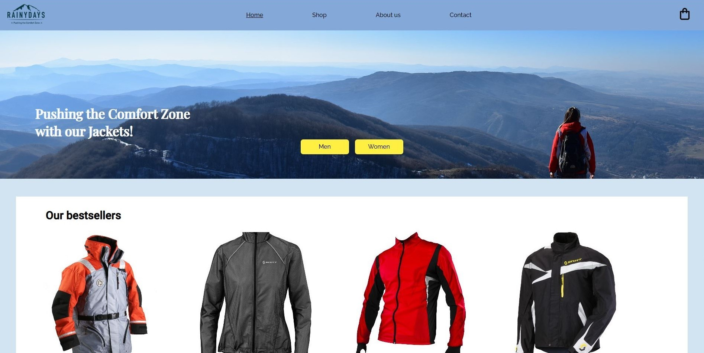

# Rainy Days Course Assignment

This is the README file for my first front-end project called "Rainy Days." This project is a simple online clothing store that I have developed as part of my front-end studies.

Project Description
"Rainy Days" is an online clothing store that focuses on clothing for rainy days. The project includes basic HTML and CSS code to display the products and provide a simple and user-friendly experience for visitors.